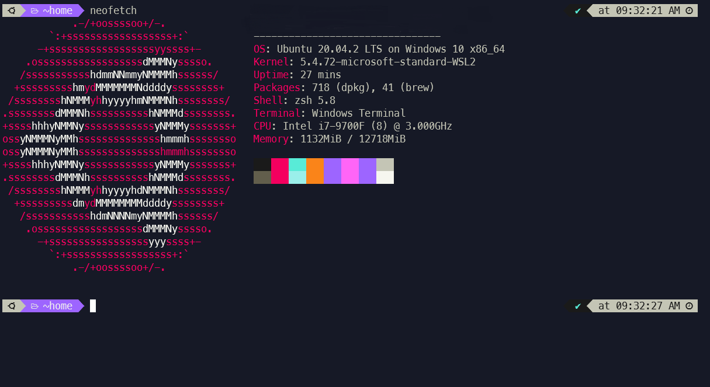

<!-- TODO: Utilize same structure as the vscode-theme repo with icon on top and descriptive steps -->
<h1 align="center">
   
  
   
  404 theme for <a href="https://www.microsoft.com/pt-br/p/windows-terminal/9n0dx20hk701?activetab=pivot:overviewtab">Windows Terminal</a>
   
</h1>

  <strong>Neon colors inspired theme with strong variants</strong>

  <a href="#install">Install</a> •
  <a href="#license">License</a>

  

## Install

All instructions can be found at [INSTALL.md](./INSTALL.md).

## License

[MIT License](./LICENSE.md)
